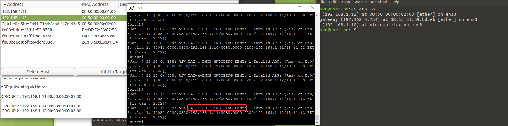

# Introduction à la sécurité des protocoles réseaux 

Hugo Marques & Emma Durand.

## 1. CAM Flooding, port-stealing et mise en œuvre de contre-mesures

**Rappels théoriques**

*- Qu'appelle-t-on CAM table lorsque l'on parle d'un switch. Expliquez la technique permettant de
la corrompre.*

La **CAM Table** est une table présente sur un switch qui contient les réferencements des adresses MAC par rapport aux interfaces connectées.

La technique de **MAC Flooding** permet de remplir la **CAM Table** (atteint sa limite) ce qui dans certains cas change le comportement d'un switch pour qu'il imite un hub (concentrateur). 

Elle consiste en l'envoi d'une grande quantité de trames ethernet sur le même port avec une adresse MAC source différente, ce qui a pour effet de saturer la **CAM Table**.

*- A l’aide de scapy, écrivez un script python permettant de provoquer le débordement de la CAM.*

* [Script python](scripts/cam_flooding.py)

*- Ecrivez ensuite un second script permettant de réaliser une attaque de type port stealing.*

* [Script python](scripts/port_stealing.py)


Sur la mac table du switch, on remarque une nouvelle entrée. Notre attaquant (0/3) est référencé avec l'adresse mac de notre victime (Linux). Grâce à wireshark, on intercepte le traffic de la victime.

**Mise en oeuvre de Port-Security**

*- En vous aidant du tableau 1 en annexe, mettez en œuvre les fonctionnalités Port-Security sur
votre switch.*

Infrastructure Eve-ng : 


Fonctionnalités mises en place pour chaque interface : 
* `switchport port-security` : Active le port security.
* `switchport port-security violation restrict` : Lorsqu'une violation est détectée, le port arrête le trafic des adresses non authorisées et envoie un message de log.
* `switchport port-security maximum 5` : Permet de définir le nombre maximum d'adresses MAC sur l'interface.

> `switchport port-security mac address xx:xx` -> sécurisé et utile, mais avec évolution du SI, peut devenir problématique.


*- Testez le bon fonctionnement de celle-ci, votre script ne doit plus permettre le débordement de
la CAM ou le « vol de port ».*

Lorsqu'on exécute l'attaque, on remarque bien que le switch détecte une anomalie et va empêcher le transfert des addresses mac malveillantes.


## 2. Mise en œuvre de la mesure de protection DHCP snooping :

**Rappels théoriques**

*- Expliquer l'attaque consistant à insérer un rogue DHCP server sur un réseau local.*

L'attaque consiste en l'intégration d'un serveur DHCP non autorisé sur un réseau, le but de ce serveur DHCP est de répondre en premier aux requêtes **DHCPDISCOVER** et ainsi introduire les équipements faisant ces demandes dans un réseau contrôlé par l'attaquant.

*- Intégrez sur votre réseau local un serveur DHCP légitime offrant l’accès à internet. Mettez ensuite en œuvre l’attaque rogue DHCP sur votre réseau afin de récupérer tout le trafic des stations de travail vers le serveur DHCP malveillant.*

**Topologie Eve-ng :**


> Plage d'adresse IP du serveur DHCP légitime : de 172.16.1.130 à 172.16.1.155.

>Plage d'adresse IP du serveur DHCP Rogue : de 172.16.1.170 à 172.16.1.190.

La linux 1 à pris une IP en DHCP du serveur DHCP légitime : 


La linux 2 à pris une IP en DHCP du serveur DHCP Rogue :


On peut ensuite capturer le traffic avec un wireshark ouvert sur l'attaquant :


**Mise en oeuvre DHCP Snooping**

*- En vous aidant des ressources fournies dans la rubrique « Aperçu du lab » ainsi que du tableau 2 en annexe, mettez en œuvre la fonctionnalité DHCP snooping sur votre switch.*

Configuration switch :

```
enable
conf t
ip dhcp snooping
ip dhcp snooping vlan 1
interface ethernet 1/0
ip dhcp snooping trust
exit
exit
exit
```

*- Testez le bon fonctionnement de celle-ci. Il ne doit maintenant plus être possible de connecter un serveur DHCP illégitime sur le réseau. Vérifiez cela.*

En activant le DHCP Snooping sur le switch et en précisant l'interface de notre DHCP légitime, tous les paquets DHCP seront envoyés vers le DHCP validé.


> La machine récupère uniquement une IP du serveur DHCP légitime.

## 3. Mise en œuvre de la mesure de protection Dynamic ARP inspection :

**Rappels théoriques**

*- Rappelez les attaques réalisables en détournant le protocole ARP.*

1. ARP cache poisoning => Man in the middle

**Mise en œuvre de Dynamic ARP inspection**

*- En vous aidant des ressources fournies dans la rubrique « Aperçu du lab » ainsi que du tableau 3 en annexe, mettez en œuvre la fonctionnalité Dynamic ARP inspection sur votre switch.*

```
enable
conf t
ip arp inspection vlan 1
interface Ethernet0/0
ip arp inspection trust
exit
interface Ethernet0/1
ip arp inspection trust
exit
interface Ethernet0/2
ip arp inspection trust
exit
interface Ethernet1/0
ip arp inspection trust
end

interface Ethernet0/3
!Interface de l'attaquant donc on ne la configure pas en mode en mode trust
```

*- Testez le bon fonctionnement de celle-ci. L’attaque ARP cache poisonning construite préalablement ne doit plus être réalisable. Vérifiez cela.*



Lorsqu'on exécute l'attaque, on remarque bien que le switch détecte une anomalie et va empêcher le transfert des paquets ARP malvaillant.

## 4. Mise en œuvre de la mesure de protection IP source guard :

**Rappels théoriques**

*- Rappelez le fonctionnement d'une attaque par IP spoofing.*

Cette attaque consiste en la création de paquets IP ayant une adresse IP source différente. Elle permet à l'attaquant d'usurper l'identité d'une source légitime et ainsi falsifiée la provenance de l'attaque (Ex: DDOS) et accéder à des services spécifiques sur le réseau.

**Mise en œuvre IP source guard**

*- En vous aidant des ressources fournies dans la rubrique « Aperçu du lab » ainsi que du tableau 4 en annexe, mettez en œuvre la fonctionnalité IP source guard sur votre switch.*

```
enable
conf t
in et0/0
ip verify source
ip verify source port-security
exit
in et0/1
ip verify source
ip verify source port-security
exit
in et0/2
ip verify source
ip verify source port-security
exit
in et0/3
ip verify source
ip verify source port-security
exit
ip source binding 00.00.00 vlan 1 0.0.0.0 interface Et0/0
ip source binding 00.00.00 vlan 1 0.0.0.0 interface Et0/1
ip source binding 00.00.00 vlan 1 0.0.0.0 interface Et0/2
ip source binding 00.00.00 vlan 1 0.0.0.0 interface Et0/3
end
```