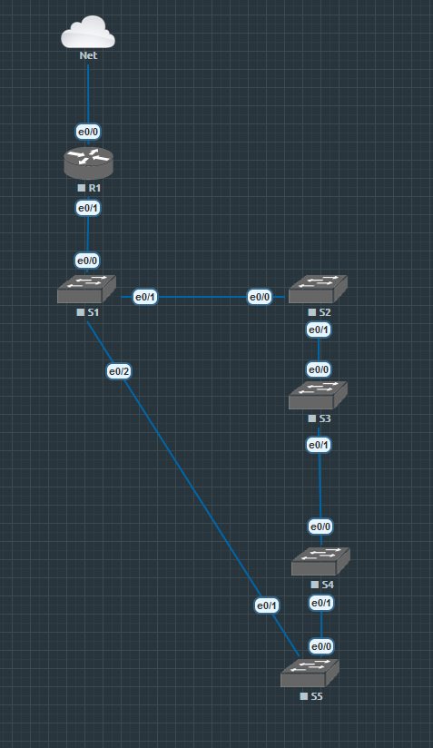
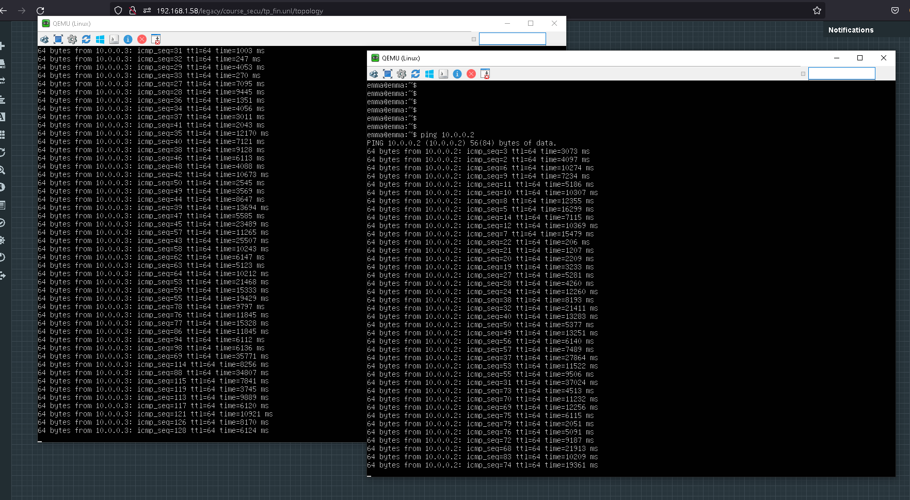
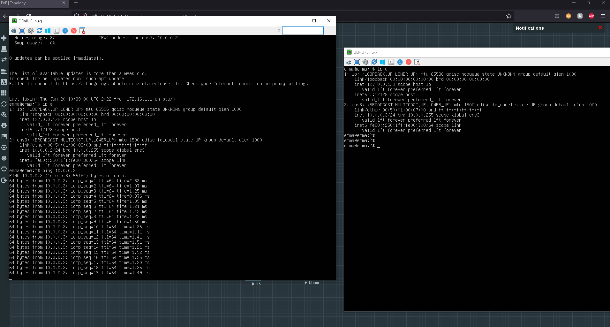
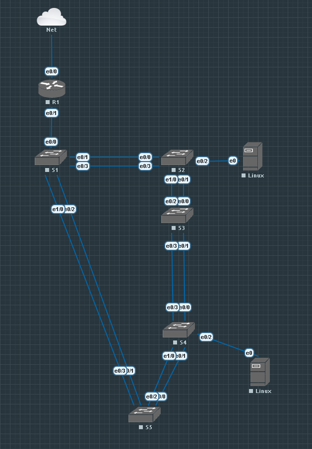
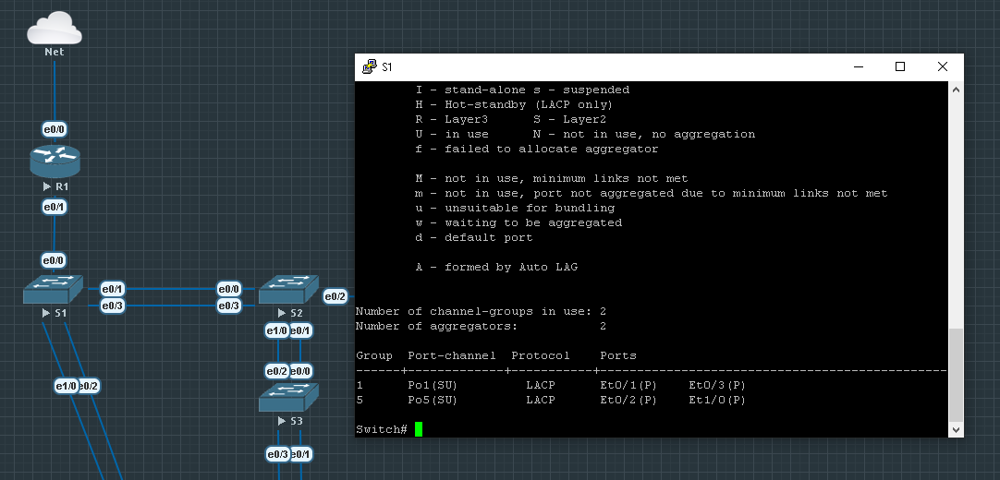
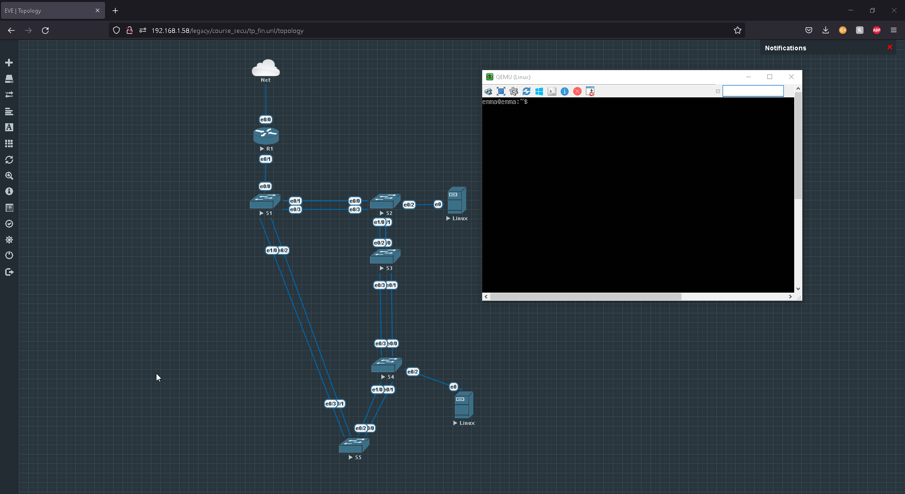

# Sécurité des architectures réseau

Hugo Marques & Emma Durand.

## Rappels théoriques

*Que signifie le terme SPOF et que désigne-t-il ?*

* Le Single Point Of Failure désigne un élément dans un SI dont le reste ou une partie de l'infrastructure dépend. Si un point tombe en panne, il ne sera plus possible de joindre une partie d'un réseau ou de fournir un service.

*Expliquer comment il est possible de supprimer des SPOF sur un réseau informatique ?*

1. Identifier le spof
2. Mise en place de contre-mesure (redondance)

## Mise en œuvre du spanning tree

### Rappels théoriques

*Qu’est-ce qu’une tempête de broadcast, et comment cela se produit-il ?*

* La tempête de broadcast est une évenement qui ce produit lorsqu'une boucle sur le réseau est créée (commutateur). De ce fait, les trames de broadcast sont transmises à l'infini en boucle sur le réseau. Ce qui a pour effet de saturer le réseau et provoquer une panne.

### Etape préliminaire

*Interconnectez vos switchs comme indiqué sur le schéma en annexe. Pour le moment chaque switch ne sera relié qu’au moyen d’un seul lien réseau.*



*Positionnez maintenant deux postes de travail sur deux switchs différents. Tentez un ping ICMP entre les deux postes que constatez vous ?*



* On peut constater que le temps de réponse pour les pings ICMP sont anormalement long.

### Mise en œuvre du protocole spanning tree 

*Vous allez maintenant configurer le protocole Spanning Tree sur vos switchs pour vous prémunir de ce genre d’incident :*

* *Lisez dans un premier temps la documentation proposée sur le site de CISCO 2, et expliquez brièvement le fonctionnement du protocole.*

À la mise en place du protocole celui-ci va définir un équipement "*root*" ainsi qu'un chemin sans boucle sur tous les équipements réseau (Minimum L2) de l'infrastructure. Le protocole va utiliser un système de priorité et de "coûts" de passage entre les commutateurs pour déterminer quelle interface sera mis en état "*bloquer*", en cas de boucle réseau.

* *Activez maintenant cette fonctionnalité sur tous vos switchs et vérifier son bon fonctionnement.*



```
enable
conf t
spanning-tree vlan 1
exit
```
## Mise en œuvre de l’agrégation de liens

### Rappels théoriques

*Quel est l’intérêt d’agréger des liens réseau ?*

L'intérêt d'agréger des liens réseau et de pouvoir redonder les connexions entre les équipements, selon la configuration cela peut aussi permettre l'augmentation de la bande passante sur cette interconnexion.

### Mise en œuvre du protocole EtherChannel

*Doublez maintenant les liens entre chacun de vos switchs et configurez le protocole EtherChannel pour agréger ces liens. Consultez la documentation Cisco3 pour mener à bien cette tâche. Testez son bon fonctionnement.*



**Configuration des interface sur le switch 1 :**



> Si l'on coupe un lien, le traffic fonctionne toujours.



SW1
```
enable
conf t
interface et0/1
channel-protocol lacp
channel-group 1 mode active
no shut
exit
interface et0/3
channel-protocol lacp
channel-group 1 mode active
no shut
exit
interface et1/0
channel-protocol lacp
channel-group 5 mode active
no shut
exit
interface et0/2
channel-protocol lacp
channel-group 5 mode active
no shut
exit
exit
```

SW2
```
enable
conf t
interface et0/0
channel-protocol lacp
channel-group 1 mode active
no shut
exit
interface et0/3
channel-protocol lacp
channel-group 1 mode active
no shut
exit
interface et0/1
channel-protocol lacp
channel-group 2 mode active
no shut
exit
interface et1/0
channel-protocol lacp
channel-group 2 mode active
no shut
exit
exit
```

SW3
```
enable
conf t
interface et0/2
channel-protocol lacp
channel-group 2 mode active
no shut
exit
interface et0/0
channel-protocol lacp
channel-group 2 mode active
no shut
exit
interface et0/3
channel-protocol lacp
channel-group 3 mode active
no shut
exit
interface et0/1
channel-protocol lacp
channel-group 3 mode active
no shut
exit
exit
```

SW4
```
enable
conf t
interface et0/3
channel-protocol lacp
channel-group 3 mode active
no shut
exit
interface et0/0
channel-protocol lacp
channel-group 3 mode active
no shut
exit
interface et1/0
channel-protocol lacp
channel-group 4 mode active
no shut
exit
interface et0/1
channel-protocol lacp
channel-group 4 mode active
no shut
exit
exit
```

SW5
```
enable
conf t
interface et0/2
channel-protocol lacp
channel-group 4 mode active
no shut
exit
interface et0/0
channel-protocol lacp
channel-group 4 mode active
no shut
exit
interface et0/3
channel-protocol lacp
channel-group 5 mode active
no shut
exit
interface et0/1
channel-protocol lacp
channel-group 5 mode active
no shut
exit
exit
```