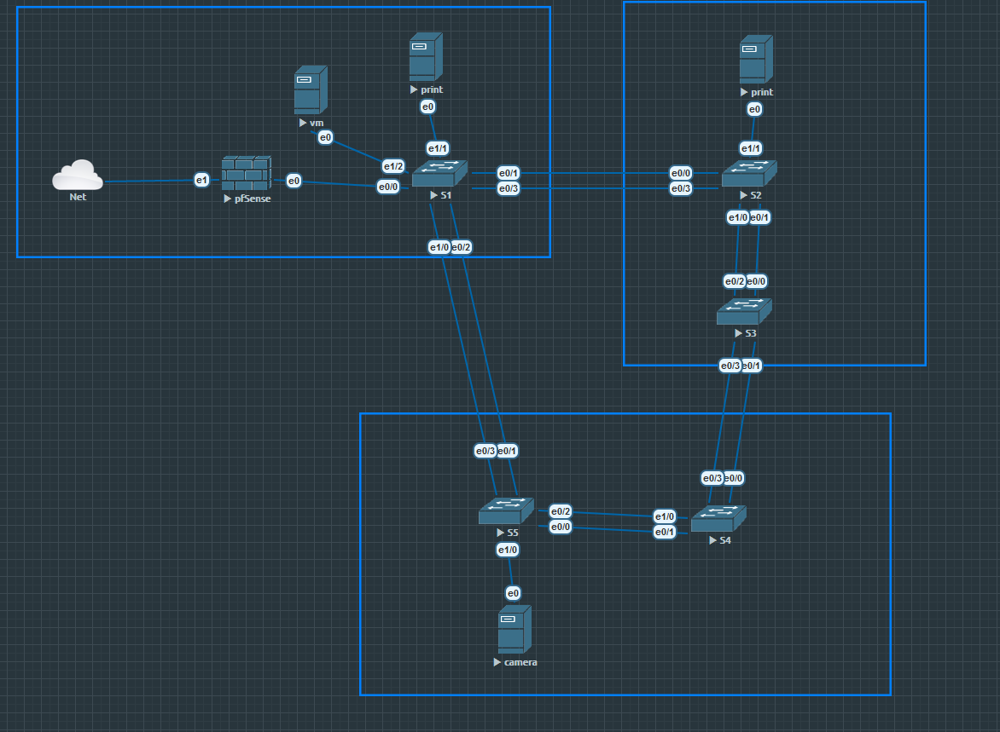
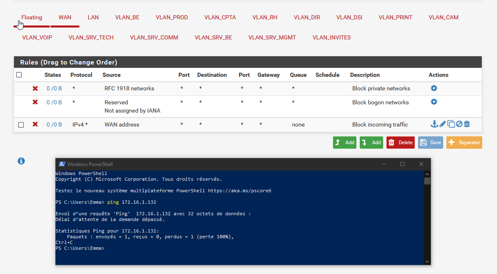
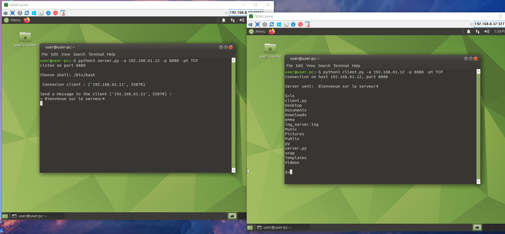
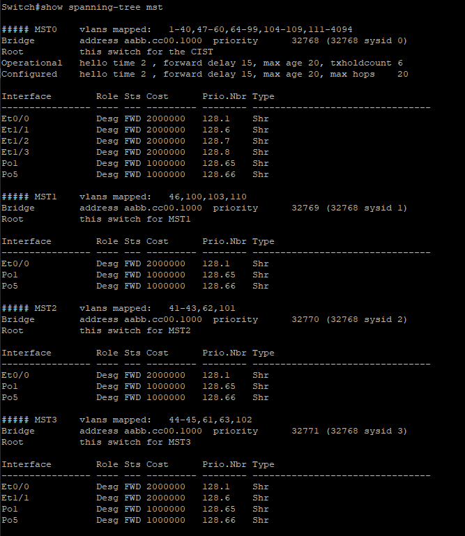
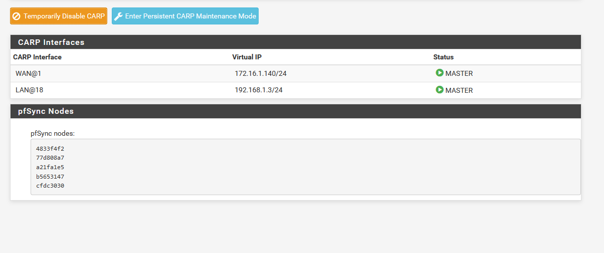
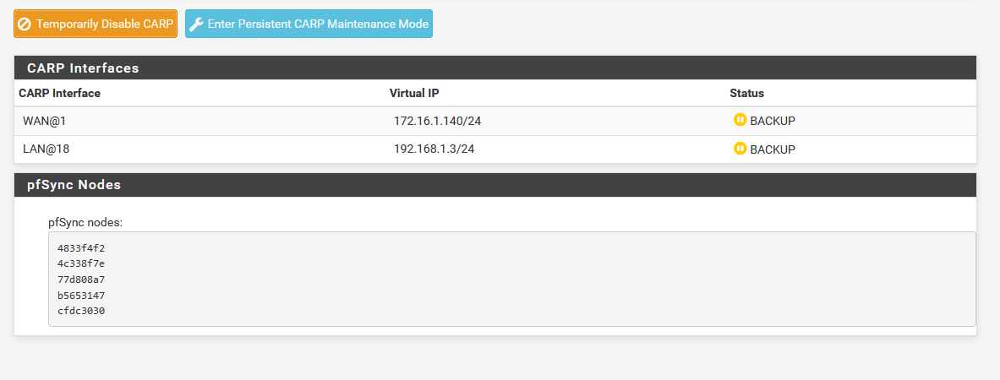
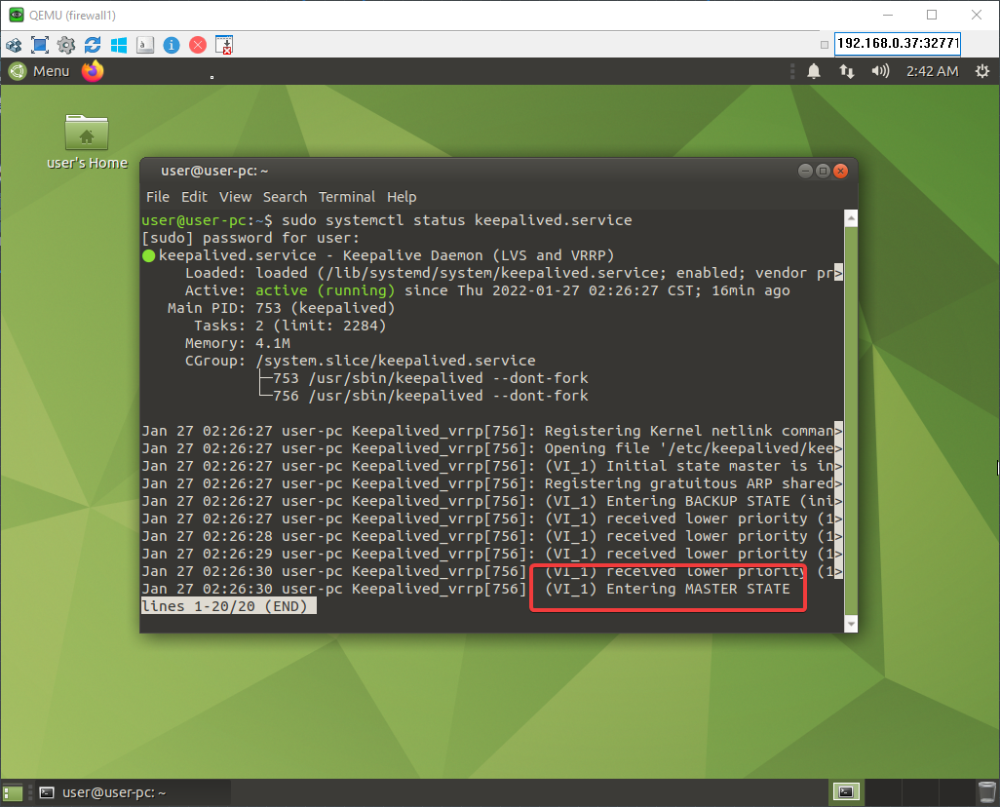
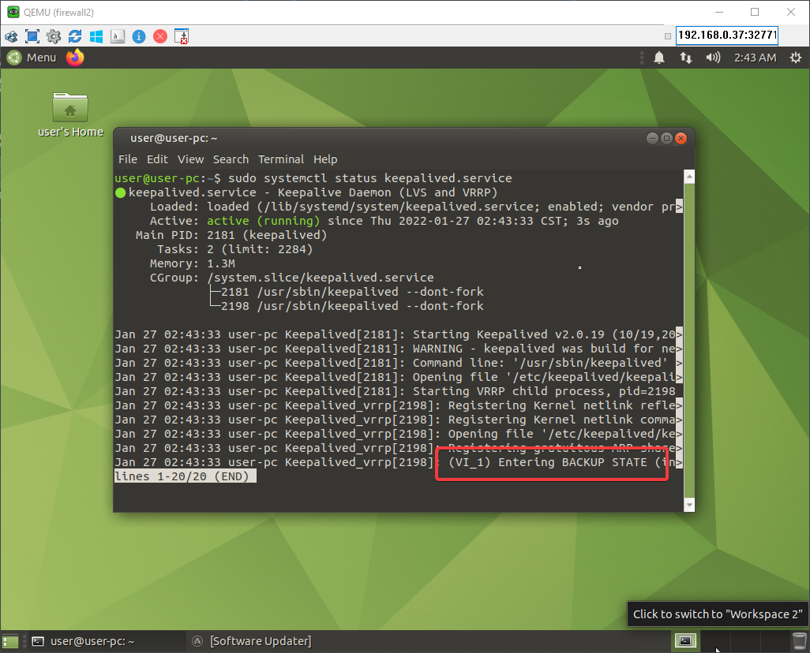
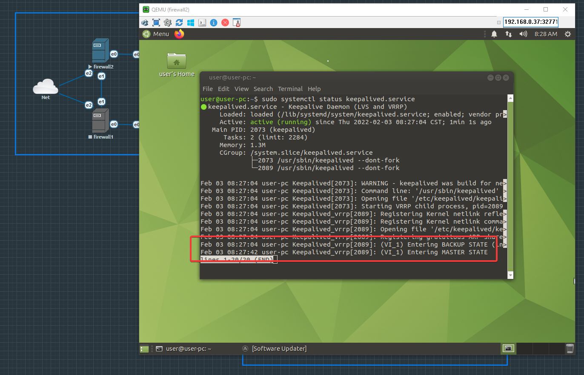

# Sécurité des architectures réseau

Hugo Marques & Emma Durand.

## Rappels théoriques

*Que signifie le terme SPOF et que désigne-t-il ?*

* Le Single Point Of Failure désigne un élément dans un SI dont le reste ou une partie de l'infrastructure dépend. Si un point tombe en panne, il ne sera plus possible de joindre une partie d'un réseau ou de fournir un service.

*Expliquer comment il est possible de supprimer des SPOF sur un réseau informatique ?*

1. Identifier le spof
2. Mise en place de contre-mesure (redondance)

## Mise en œuvre du spanning tree

### Rappels théoriques

*Qu’est-ce qu’une tempête de broadcast, et comment cela se produit-il ?*

* La tempête de broadcast est une évenement qui ce produit lorsqu'une boucle sur le réseau est créée (commutateur). De ce fait, les trames de broadcast sont transmises à l'infini en boucle sur le réseau. Ce qui a pour effet de saturer le réseau et provoquer une panne.

### Etape préliminaire

*Interconnectez vos switchs comme indiqué sur le schéma en annexe. Pour le moment chaque switch ne sera relié qu’au moyen d’un seul lien réseau.*


*Positionnez maintenant deux postes de travail sur deux switchs différents. Tentez un ping ICMP entre les deux postes que constatez vous ?*


* On peut constater que le temps de réponse pour les pings ICMP sont anormalement long.

### Mise en œuvre du protocole spanning tree 

*Vous allez maintenant configurer le protocole Spanning Tree sur vos switchs pour vous prémunir de ce genre d’incident :*

* *Lisez dans un premier temps la documentation proposée sur le site de CISCO 2, et expliquez brièvement le fonctionnement du protocole.*

À la mise en place du protocole celui-ci va définir un équipement "*root*" ainsi qu'un chemin sans boucle sur tous les équipements réseau (Minimum L2) de l'infrastructure. Le protocole va utiliser un système de priorité et de "coûts" de passage entre les commutateurs pour déterminer quelle interface sera mis en état "*bloquer*", en cas de boucle réseau.

* *Activez maintenant cette fonctionnalité sur tous vos switchs et vérifier son bon fonctionnement.*


```
enable
conf t
spanning-tree vlan 1
exit
```
## Mise en œuvre de l’agrégation de liens

### Rappels théoriques

*Quel est l’intérêt d’agréger des liens réseau ?*

L'intérêt d'agréger des liens réseau et de pouvoir redonder les connexions entre les équipements, selon la configuration cela peut aussi permettre l'augmentation de la bande passante sur cette interconnexion.

### Mise en œuvre du protocole EtherChannel

*Doublez maintenant les liens entre chacun de vos switchs et configurez le protocole EtherChannel pour agréger ces liens. Consultez la documentation Cisco3 pour mener à bien cette tâche. Testez son bon fonctionnement.*


**Configuration des interface sur le switch 1 :**


> Si l'on coupe un lien, le traffic fonctionne toujours.


# Protection périmétrique, cloisonnement interne et MSTP

## Mise en œuvre de la protection périmétrique

- Installer un pfsense.



> Le traffic entrant est interdit.



## Mise en œuvre du cloisonnement

- Mise en place des vlans.

## Paramétrage du filtrage inter-vlans

- Mise en place de règles de filtrage sur le pare-feu (via document fourni).

- Tester le fonctionnement avec l'outil de diagnostique que la connexion entre les deux machines est établie.



> La connexion s'est bien effectuée entre deux machines du vlan 61 (PRINT) via l'outils de diagnostique python.

## Activation du MSTP

```
enable
conf t
spanning-tree mst configuration
instance 1 vlan 46, 100, 103, 110
instance 2 vlan 41, 42, 43, 62, 101
instance 3 vlan 44, 45, 61, 63, 102
exit
spanning-tree mode mst
exit
```

Sur SW1: 



Si on coupe un lien, on remarque que l'outil de diagnostique fontionne toujours et notre MSTP aussi :


# Publication de services sur internet, DMZ et VRRP

## Mise en œuvre du cluster interne pour le filtrage intervlan 


* installez un second firewall pfsense : ok.
* activez les fonctionnalités CARP5 sur les deux Pfense afin de les monter en cluster.

Sur le pfsense 1 (master) :



Sur le pfsense 2 (slave) :




> Si on éteint un des deux pfsenses, le deuxième prend le relais.


## Mise en œuvre du cluster de firewalls périmétriques

* Installez deux serveurs Linux Debian partageant la même adresse IP via VRRP.


La debian1 est en **master** et la debian 2 en **backup** :





iptable :

```

sudo iptables -t filter -P INPUT DROP 
sudo iptables -t filter -P FORWARD DROP 
sudo iptables -t filter -P OUTPUT DROP

sudo iptables -A INPUT -m state --state RELATED,ESTABLISHED -j ACCEPT

sudo iptables -I OUTPUT -p tcp -m tcp --dport 80 -j ACCEPT
sudo iptables -I OUTPUT -p tcp -m tcp --dport 443 -j ACCEPT
sudo iptables -I OUTPUT -p tcp -m tcp --dport 445 -j ACCEPT
sudo iptables -I OUTPUT -p tcp -m tcp --dport 587 -j ACCEPT
sudo iptables -I OUTPUT -p tcp -m tcp --dport 993 -j ACCEPT
sudo iptables -I OUTPUT -p udp -m udp --dport 53 -j ACCEPT
sudo iptables -I OUTPUT -p udp -m udp --dport 123 -j ACCEPT

sudo iptables-save >/etc/sysconfig/iptables

sudo service iptables restart
```

Si l'on éteint la debian1, la debian2 passe en status **Master** :

